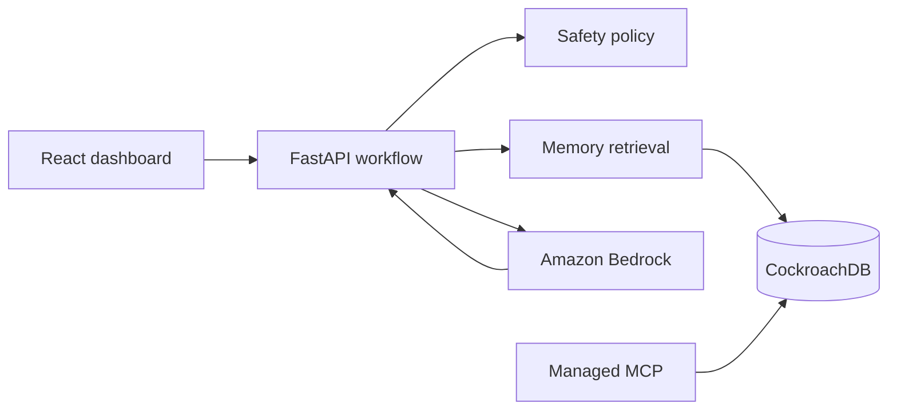

# GridRecall

**Every fault makes the next repair faster.**

GridRecall is an operational-memory agent for solar mini-grid technicians. It retrieves similar faults, previous repair attempts and measured outcomes so teams can restore outages faster without repeating the same failed fix across different communities.

The prototype is built for the CockroachDB × AWS Agentic AI Hackathon. It demonstrates a complete feedback loop:

> Incident → evidence → recommendation → human decision → action → outcome → memory

## What the current milestone proves

The repository contains a credential-free two-incident demonstration:

1. An inverter at Ajegunle overheats and loses output.
2. With no relevant memory, GridRecall begins with the conservative reset playbook.
3. The reset fails; inspecting and clearing ventilation restores service.
4. GridRecall stores both attempts and their measured outcome.
5. A related fault appears at Kura on the same inverter model.
6. The Ajegunle memory causes GridRecall to prioritise ventilation inspection and avoid repeating the failed reset.

All times and energy values in this simulator are controlled demonstration outputs, not field-performance claims.

## Architecture



The production design uses:

- **CockroachDB Distributed Vector Indexing** for semantic incident retrieval.
- **CockroachDB Cloud Managed MCP Server** for controlled agent access to structured operational evidence.
- **Amazon Bedrock** for structured diagnosis and explanation.
- **Amazon Titan Text Embeddings V2** for 1024-dimensional incident embeddings.
- **FastAPI** for workflow, policy enforcement and transactional writes.
- **React + TypeScript** for the operations dashboard.

The current branch deliberately uses an in-memory repository and stable local embeddings so anyone can run and verify the core behavior before cloud credentials are configured. Production adapters are the next milestone.

## Repository layout

```text
gridrecall/
├── apps/dashboard/          React + TypeScript operations dashboard
├── services/api/            FastAPI incident and memory workflow
├── migrations/              CockroachDB transactional/vector schema
├── docs/                    Architecture and demo plan
├── .github/workflows/       API and dashboard CI
├── docker-compose.yml       Local CockroachDB node
└── Makefile                 Developer commands
```

## Run locally

Requirements:

- Python 3.11+
- Node.js 22+

### API

```bash
python -m venv .venv
source .venv/bin/activate
pip install -e "services/api[dev]"
uvicorn gridrecall_api.main:app --app-dir services/api/src --reload
```

The API runs at `http://localhost:8000`; Swagger documentation is available at `http://localhost:8000/docs`.

### Dashboard

In a second terminal:

```bash
npm --prefix apps/dashboard install
npm --prefix apps/dashboard run dev
```

Open `http://localhost:5173`, then run the Ajegunle and Kura scenarios in order.

## API surface

| Method | Route | Purpose |
|---|---|---|
| `GET` | `/health` | Runtime and mode check |
| `GET` | `/api/demo` | Current fleet, incident and memory state |
| `POST` | `/api/demo/incidents/first` | Resolve and remember the Ajegunle incident |
| `POST` | `/api/demo/incidents/second` | Prove cross-site memory on the Kura incident |
| `POST` | `/api/demo/reset` | Return the demonstration to a clean state |
| `POST` | `/api/recommendations` | Produce a policy-checked recommendation for supplied context |

## Validation

```bash
make api-lint
make api-test
make web-build
```

The tests verify retrieval ranking, policy enforcement, reset idempotency and the central acceptance criterion: the second incident uses outcome memory and does not repeat the failed reset.

## Safety

GridRecall does not control electrical equipment. Recommendations are restricted to an approved action catalogue, checked against technician qualifications and presented for human approval. Unknown or dangerous conditions are escalated.

See [architecture details](docs/architecture.md) and the [three-minute demo blueprint](docs/demo-script.md).

## Roadmap

- [x] Deterministic telemetry and two-site fault simulator
- [x] Incident-to-outcome domain model
- [x] Hybrid local memory ranking and policy engine
- [x] Operator dashboard and replayable demonstration
- [x] CockroachDB relational/vector schema
- [ ] CockroachDB repository and transaction adapter
- [ ] Titan embedding adapter and production vector queries
- [ ] Bedrock structured-recommendation adapter
- [ ] Managed MCP read-only investigation tools
- [ ] AWS Lambda/API Gateway and S3/CloudFront deployment
- [ ] Failure-resume, audit and integration tests

## Licence

[MIT](LICENSE) © 2026 Aleshinloye Olamilekan
