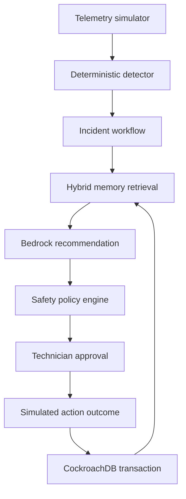

# GridRecall architecture

GridRecall is an incident-to-outcome memory system. It is not an autonomous electrical controller. The agent interprets evidence and proposes a catalogue action; deterministic policy and a qualified human retain authority.

## Memory model

| Memory type | Durable content | Prototype state |
|---|---|---|
| Working | Current incident, telemetry snapshot and workflow version | Implemented in the demo service |
| Episodic | Previous fault, attempted actions and measured outcome | Implemented |
| Semantic | Site, asset and equipment configuration | Seeded simulator profiles |
| Procedural | Approved actions, qualification rules and escalation limits | Implemented policy engine |
| Human | Technician decision, observation and correction | Represented in repair attempts |

## Critical consistency boundary

Production commits the following records as one CockroachDB transaction:

1. Recommendation and model/prompt provenance.
2. Historical memories used as evidence.
3. Technician approval, rejection or modification.
4. Action attempted and its sequence.
5. Observed outcome and outcome score.
6. New incident-memory embedding.

This prevents an outcome from being stored without the recommendation and evidence that produced it.

## Retrieval contract

The production retriever ranks safe, resolved cases using:

- Vector similarity of symptoms and notes.
- Exact equipment-model match.
- Fault-category match.
- Symptom overlap.
- Verified outcome quality.

The local adapter uses stable hash embeddings so the demonstration and tests need no credentials. The production adapter will use Amazon Titan Text Embeddings V2 and CockroachDB's cosine-distance operator.

## Safety boundary

- The model may select only an enumerated action.
- The policy engine validates technician qualification.
- Every consequential action requires human approval.
- Electrical isolation requires an electrical technician.
- Smoke, unsafe temperature or unknown conditions force escalation.
- No API in this prototype can send commands to physical equipment.

## Planned deployment

| Component | Runtime |
|---|---|
| Dashboard | S3 and CloudFront |
| HTTP API | API Gateway and Lambda |
| Reasoning | Amazon Bedrock |
| Embeddings | Amazon Titan Text Embeddings V2 |
| Transactional/vector memory | CockroachDB Cloud Basic |
| Agent read tools | CockroachDB Cloud Managed MCP Server |
| Secrets | AWS Secrets Manager |
| Logs | CloudWatch |
